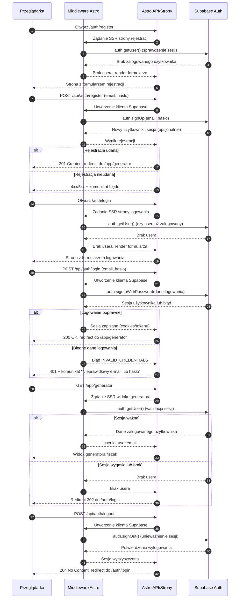

<authentication_analysis>

1. Główne przepływy autentykacji z PRD i auth-spec:
   - Rejestracja nowego użytkownika (US-001) z wykorzystaniem Supabase Auth.
   - Logowanie użytkownika istniejącego (US-002) z utrzymaniem sesji.
   - Wylogowanie użytkownika (US-003) i unieważnienie sesji.
   - Dostęp do zasobów chronionych (US-013) z guardami w Astro SSR i RLS w Supabase.
   - Opcjonalnie: odzyskiwanie hasła (przygotowana ścieżka, nie wymagane w MVP).

2. Główni aktorzy:
   - Użytkownik / Przeglądarka (Browser).
   - Middleware Astro (spina requesty z Supabase clientem).
   - Warstwa Astro API / Strony (Astro API).
   - Supabase Auth (zewnętrzny dostawca uwierzytelniania i sesji).

3. Procesy weryfikacji i odświeżania tokenów:
   - Supabase Auth po poprawnym logowaniu/rejestracji wydaje tokeny i zapisuje sesję
     (w praktyce w cookies lub pamięci zgodnie z konfiguracją).
   - Middleware/strony Astro przy każdym żądaniu korzystają z klienta Supabase
     do wywołania `auth.getUser()`, co weryfikuje ważność sesji i tokenu.
   - Odświeżanie tokenu jest realizowane po stronie Supabase i klienta Supabase
     (mechanizm wbudowany), a aplikacja bazuje na wyniku `getUser()` – jeśli sesja
     wygasła, użytkownik jest traktowany jako niezalogowany i przekierowywany.

4. Kroki wysokopoziomowe:
   - Rejestracja:
     - Użytkownik otwiera stronę rejestracji, wypełnia formularz.
     - Browser wysyła żądanie POST do Astro API `/api/auth/register`.
     - Astro poprzez Supabase Auth tworzy konto i (opcjonalnie) sesję.
     - W przypadku sukcesu następuje redirect do widoku zalogowanego (np. generator).
   - Logowanie:
     - Użytkownik otwiera stronę logowania, wypełnia formularz.
     - Browser wysyła POST do `/api/auth/login`.
     - Astro wywołuje Supabase Auth `signInWithPassword`, ustawia sesję.
     - Po sukcesie następuje redirect do `/app/generator`.
   - Wejście na stronę chronioną:
     - Browser wysyła żądanie GET do strony `/app/...`.
     - Middleware tworzy klienta Supabase, Astro API/strona wywołuje `auth.getUser()`.
     - Jeśli user jest, renderuje się widok; jeśli nie, redirect do `/auth/login`.
   - Wylogowanie:
     - Browser wywołuje POST `/api/auth/logout`.
     - Astro API wzywa `supabase.auth.signOut()` i unieważnia sesję.
     - Browser jest przekierowywany do `/auth/login` lub `/`.
   - Wygaśnięcie lub nieprawidłowy token: - Przy kolejnym żądaniu SSR `auth.getUser()` zwraca brak usera. - Strona chroniona wykonuje redirect do `/auth/login`.
     </authentication_analysis>

<mermaid_diagram>

</mermaid_diagram>
